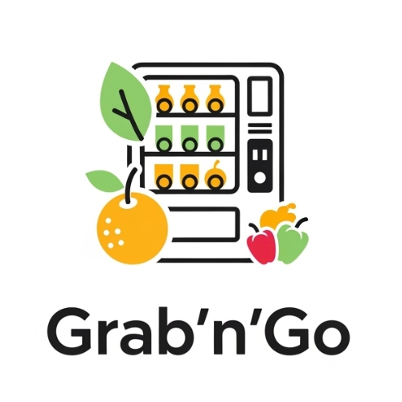

Grab'n'Go - App Mobile

  

**Grab'n'Go** è un'app mobile sviluppata in **React Native** che connette gli utenti a distributori automatici intelligenti. L'app consente di localizzare distributori, consultare i prodotti, acquistare e gestire il proprio account direttamente dallo smartphone.

## ✨ Funzionalità Principali

* **Autenticazione e Profilo Utente**: Registrazione, login (Supabase Auth) e gestione completa del profilo.
* **Mappa Interattiva**: Trova i distributori più vicini grazie alla geolocalizzazione.
* **Ricerca e Filtri**: Cerca distributori per nome e filtra i prodotti per categoria.
* **Flusso di Acquisto Completo**: Sfoglia i prodotti, gestisci il carrello ed effettua il pagamento in-app.
* **QR Code per il Ritiro**: Ottieni un QR Code univoco post-pagamento per ritirare i prodotti.
* **Cronologia Ordini**: Visualizza un riepilogo di tutti i tuoi acquisti.
* **Offerte e Ricette**: Sezioni dedicate a promozioni e idee creative.

## 🛠️ Tecnologie Utilizzate

* **Frontend**: React Native (con Expo)
* **Backend & Database**: Supabase (PostgreSQL, Auth, Storage)
* **Navigazione**: React Navigation
* **Mappe**: react-native-maps

## 🚀 Installazione

Per eseguire il progetto in locale, segui questi passaggi.

#### 1. Prerequisiti
* Node.js (v18 o superiore)
* App Expo Go installata sul tuo smartphone
* Un account [Supabase](https://supabase.com)

#### 2. Setup
##### Clona il repository
git clone [https://github.com/pacoz03/grabngo.git](https://github.com/pacoz03/grabngo.git)
cd grabngo

##### Installa le dipendenze
npm install

#### 3. Configurazione di Supabase
1. Crea un progetto su Supabase.
2. Imposta lo schema del database.
3. Vai nella sezione "SQL Editor" del tuo progetto Supabase.
4. Copia e incolla il contenuto dello script per la creazione delle tabelle e delle policy (fornito separatamente).
5. Esegui lo script per creare la struttura del database. Successivamente, esegui lo script per il popolamento dei dati per avere un database di partenza.
6. Crea un file .env nella root del progetto.
Vai su "Project Settings" > "API" nel tuo progetto Supabase.
Copia la tua URL e la tua chiave API anon (public) e incollale nel file .env nel modo seguente:
EXPO_PUBLIC_SUPABASE_URL=LA_TUA_URL_SUPABASE
EXPO_PUBLIC_SUPABASE_ANON_KEY=LA_TUA_CHIAVE_ANON_PUBBLICA

#### 5. Avvio
npm start

A questo punto, scansiona il QR code generato nel terminale con l'app **Expo Go**.

## 🤝 Contributi
I contributi sono sempre benvenuti! Sentiti libero di aprire una issue o una pull request.
